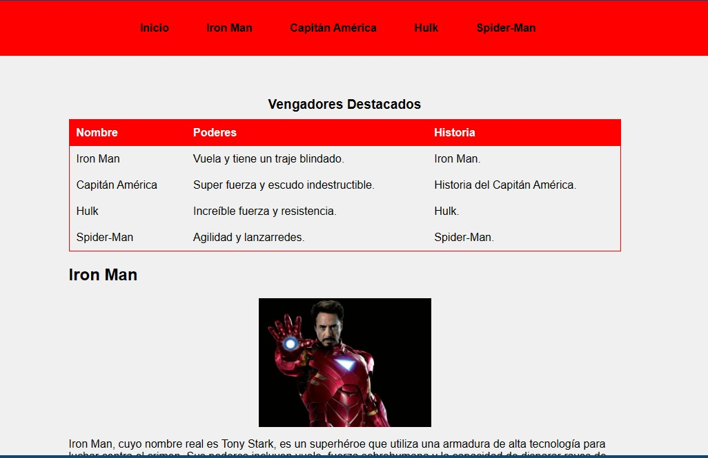
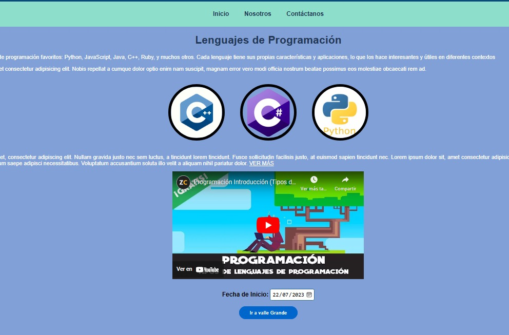
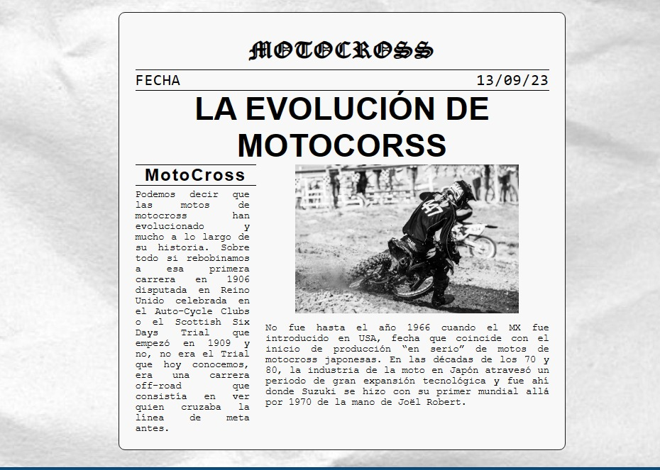

# CURSO CULTURA ARTÍSTICA

## Descripción

Todos mis trabajos en el curso de Cultura Artística

- Fundamento en Desarrollo en Html , Css
-  Diseño de una página web
- Responsive en una página web

## RETO 1

Lorem ipsum dolor sit amet consectetur adipisicing elit. Iusto, cupiditate!

## RETO 2

Lorem ipsum dolor sit amet consectetur adipisicing elit. Iusto, cupiditate!

## RETO 3

Lorem ipsum dolor sit amet consectetur adipisicing elit. Iusto, cupiditate!
